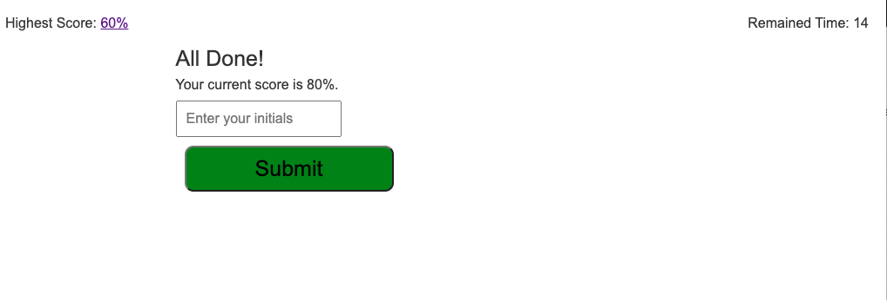

# Quiz on JavaScript fundamental

## Description

A timed quiz on JavaScript fundamental that contain 5 Multiple choices. Users are presented with a question. if user answer correctly 20 point of score will be added, if the answer is incorrect the time will be subtraced from the clock.after completion the score and user initials will be saved to the LocalStoreage

## Installation
This is a browser-based application. The code consists of the following files:

- `index.html`: Contains the structure of the home page.
- `asset/css/files`: contain styling file for the webpage.
- `assets/js/files`: Implements the interactivity of the app.

## Usage

Feel free to use this code as a starter for your own webpage. You can customize the design by modifying the HTML, CSS, and JavaScript files.

Visit the [deployed webpage](https://bazrahimi.github.io/javascript-quiz/) to see the live version.

*Description: An example of a quiz question with multiple choices and a time, highest past score and correct feedback specific question*

*Description: indicating that quiz is completed, previous highest score, current score,input box for the users to insert and initials, remainting timen and a submit button *

*Description: indicating the Highest score to date, other previous scores, Go back to home page, and clear score optionality.*

## Credits
- Zoom Recording: [https://applications.zoom.us/lti/rich/home/recording/detail](https://applications.zoom.us/lti/rich/home/recording/detail)

## License

The code is released under the MIT License. Feel free to use, modify, and distribute it.

---
